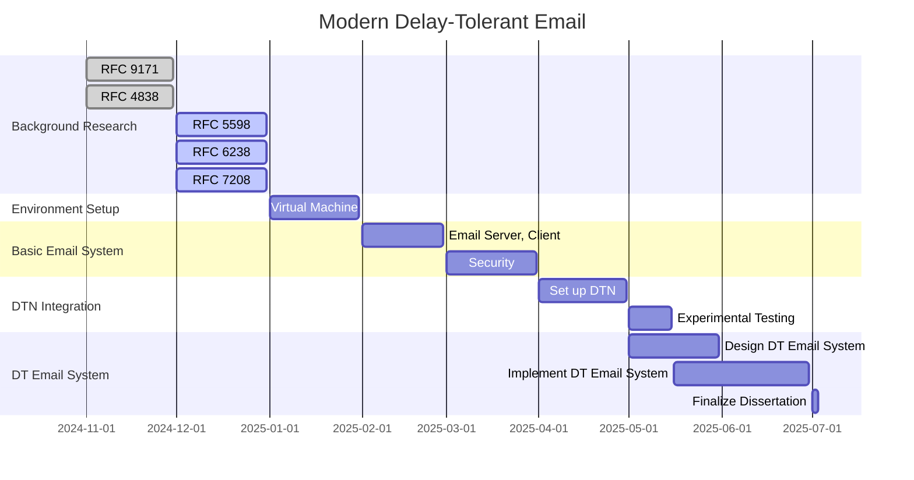

# Plan

## November

Read articles:

- [Delay/Disruption Tolerant Networking (dtn)](https://datatracker.ietf.org/wg/dtn/documents/)
- [RFC 9171 - Bundle Protocol Version 7](https://datatracker.ietf.org/doc/rfc9171/)

## December

Read articles:

- [RFC 4838 - Delay-Tolerant Networking Architecture](https://datatracker.ietf.org/doc/html/rfc4838)
- [RFC 5598: Internet Mail Architecture](https://www.rfc-editor.org/rfc/rfc5598)
- read about email incl. 2 factor auth, anti spam techniques
- postfix/dovecot
  [How To Set Up a Postfix E-Mail Server with Dovecot | DigitalOcean](https://www.digitalocean.com/community/tutorials/how-to-set-up-a-postfix-e-mail-server-with-dovecot)

## January

Set up Virtual Machine.

## February

Set up an email server, and an email client.

## March

Send and receive email between two clients. Incorporate security technologies into the email network.

## April

(Final Test)

## May

Set up a DTN, and incorporate email system into it.

Experimental testing.

## June

Design and implement a new delay-tolerant email system.

## July

Finalizing the dissertation.

