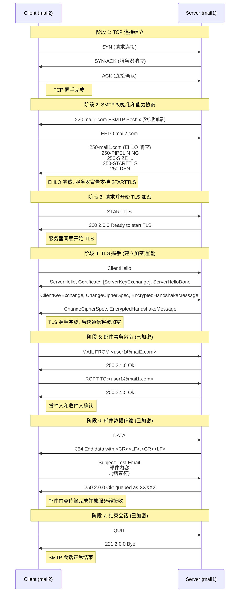

[邮件系统详解 - Exungsh💫 - 博客园](https://www.cnblogs.com/exungsh/p/15890891.html)

## 历史

互联网之前发明 ARPANET  Ray Tomlinson  @

## 协议

MUA的全称是Mail User Agent、email client

MTA的全称是Mail Transfer Agent

MDA的全称是Mail Delivery Agent

MSA是的全称是Mail Submission Agent

- IMAP使用143端口，经过SSL/TLS加密的IMAPS协议使用993端口。
- POP3使用110端口，经过SSL/TLS加密的POP3S协议使用995端口。
- SMTP使用25端口，经过SSL/TLS加密的SMTPS协议使用465端口。

STARTTLS可以在原有的端口上加密IMAP、POP3和SMTP协议，它们分别仍然使用143、110、25端口。

Dovecot把MDA称为LDA(Local Delivery Agent)

[电子邮件系统是如何运作的？ - Linux大神博客](https://www.linuxdashen.com/电子邮件系统是如何运作的？)

```drawio
graphConfig = {
    "source": "./.assets/Email.drawio"
}
```

```drawio
graphConfig = {
    "source": "./.assets/email-emulator.drawio"
}
```

```bash
#docker build -t mail-server .
#docker network create mail-network

#docker run -d --name mail1 --hostname mail1 --network mail-network -e HOSTNAME=mail1 -e DOMAIN=example.com mail-server

#docker run -d --name mail2 --hostname mail2 --network mail-network -e HOSTNAME=mail2 -e DOMAIN=example.com mail-server

docker compose up -d --build

docker exec -it mail1 bash
cat /var/log/mail.log
# Send email
docker exec -it mail1 bash
echo "Hello from mail1" | mail -s "Test Email" user1@mail.2.com

docker exec -it mail2 bash
cat /var/mail/user1

# Reply emial
echo "Reply from mail2" | mail -s "Test Reply" user1@mail.1.com

cat /var/mail/user1
cat /var/log/mail.log


docker compose down -v
```

tc ca thunderbird



