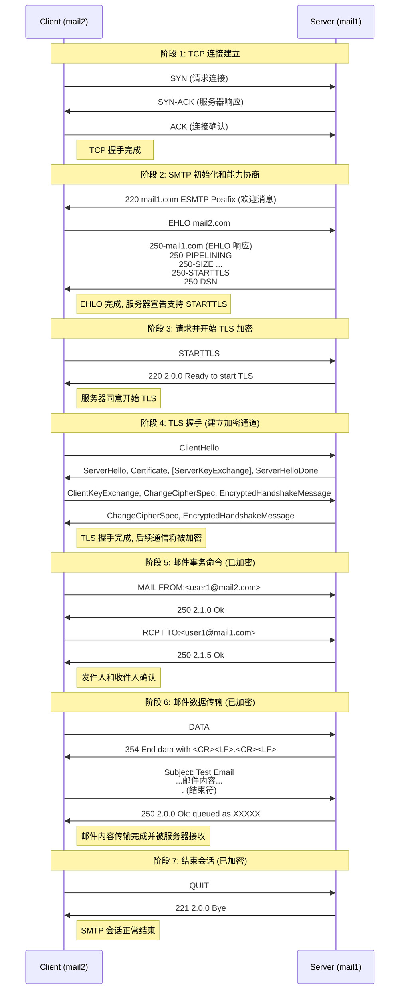

[邮件系统详解 - Exungsh💫 - 博客园](https://www.cnblogs.com/exungsh/p/15890891.html)

## 历史

互联网之前发明 ARPANET  Ray Tomlinson  @

## 协议

MUA的全称是Mail User Agent、email client

MTA的全称是Mail Transfer Agent

MDA的全称是Mail Delivery Agent

MSA是的全称是Mail Submission Agent

- IMAP使用143端口，经过SSL/TLS加密的IMAPS协议使用993端口。
- POP3使用110端口，经过SSL/TLS加密的POP3S协议使用995端口。
- SMTP使用25端口，经过SSL/TLS加密的SMTPS协议使用465端口。

STARTTLS可以在原有的端口上加密IMAP、POP3和SMTP协议，它们分别仍然使用143、110、25端口。

Dovecot把MDA称为LDA(Local Delivery Agent)

[电子邮件系统是如何运作的？ - Linux大神博客](https://www.linuxdashen.com/电子邮件系统是如何运作的？)

```drawio
graphConfig = {
    "source": "./.assets/Email.drawio"
}
```

```drawio
graphConfig = {
    "source": "./.assets/email-emulator.drawio"
}
```

```bash
tc qdisc del dev eth0 root
tc qdisc add dev eth0 root netem delay 500ms
tc qdisc replace dev eth0 root netem delay 0ms

cd Code/
xhost +
docker compose up -d --build
docker compose exec mail-3 /bin/bash
thunderbird

# mail--1
# user@mail-1.a.com
# mail--2
# user@mail-2.a.com


# Send email
#docker exec -it mail1 bash
echo "Hello from mail1" | mail -s "Test Email" user1@mail-2.a.com

#docker exec -it mail2 bash
ls /home/user1/Maildir/new/
cat /home/user1/Maildir/new/

# Reply emial
echo "Reply from mail2" | mail -s "Test Reply" user1@mail-1.a.com

cat /var/mail/user1
cat /var/log/mail.log

# mail1 - 172.21.0.3
# mail2 - 172.22.0.3

docker compose down -v
```

tc ca thunderbird




ion -> bp -> ltp -> ipn

```bash
# 修改配置文件 2.bench.udp -> 
#bench.ionconfig
删除 wmKey 66236
删除 sdrName ion2
#bench.bprc
a induct udp 172.21.0.3:2113 udpcli
a outduct udp 172.22.0.3:3113 'udpclo 1'
#bench.ipnrc
a plan 3 udp/172.22.0.3:3113

# 修改配置文件 3.bench.udp -> 
#bench.ionconfig
删除 wmKey 66236
删除 sdrName ion2
#bench.bprc
a induct udp 172.22.0.3:3113 udpcli
a outduct udp 172.21.0.3:2113 'udpclo 1'
#bench.ipnrc
a plan 2 udp/172.21.0.3:2113

# 启动ION-DTN
cd /usr/local/src/ION-DTN/demos/bench-udp/2.bench.udp
./ionstart
cd /usr/local/src/ION-DTN/demos/bench-udp/3.bench.udp
./ionstart

# 测试
bpcounter ipn:3.2 3
bpdriver 3 ipn:2.2 ipn:3.2 -10000

bpsink ipn:3.2
bpsource ipn:3.2 <<EOF
From: alice@ion
To: bob@ion
Subject: Multi-line Test

Hello Bob,
This is the first line.
This is the second line.
!
EOF
```


./ionstart 启动配置文件顺序

```bash
# .ionrc
1 2 bench.ionconfig	# 初始化 ION 节点，设置为 2 号，用 .ionconfig 文件里的参数来配置数据存储区和共享内存等核心资源
s					# 启动 ION 节点
m horizon +0		# 持续预测未来网络是否会发生拥塞
# .ionconfig
#wmKey 66236
#sdrName ion2
wmSize 50000000
configFlags 1
heapWords 20000000

# global.ionrc
m horizon  +0
a range    +0 +600		2 3   1
a contact  +0 +600		2 3   100000
a contact  +0 +600		3 2   100000

# bench.ionsecrc
1

# [bench.ltprc]

# .bprc
1
a scheme ipn 'ipnfw' 'ipnadminep'
a endpoint ipn:2.0 x
a endpoint ipn:2.1 x
a endpoint ipn:2.2 x
a endpoint ipn:2.64 x
a endpoint ipn:2.65 x
a protocol udp 1400 100
a induct udp 172.21.0.3:2113 udpcli
a outduct udp 172.22.0.3:3113 'udpclo 1'
r 'ipnadmin bench.ipnrc'
s
# ipnrc
a plan 3 udp/172.22.0.3:3113
```
